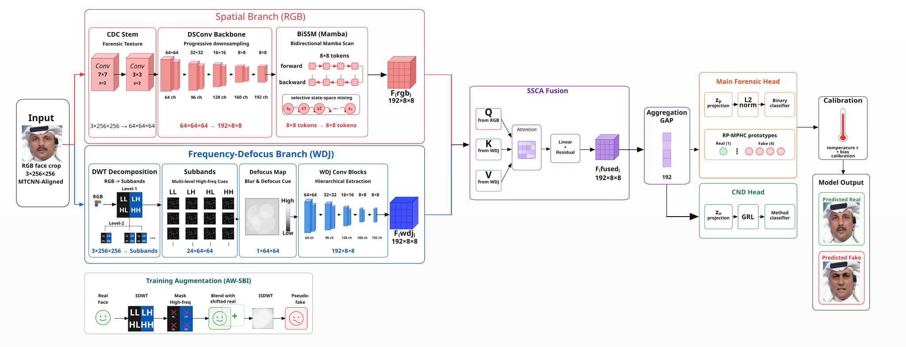
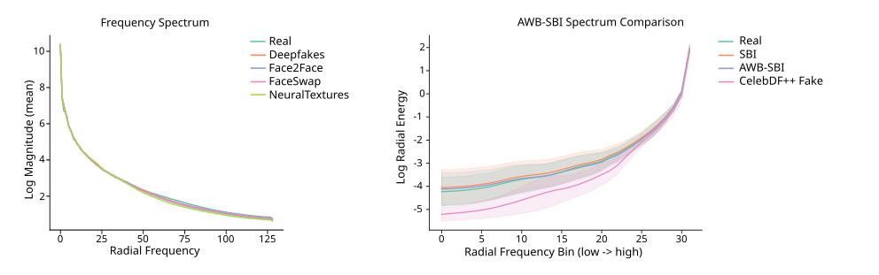
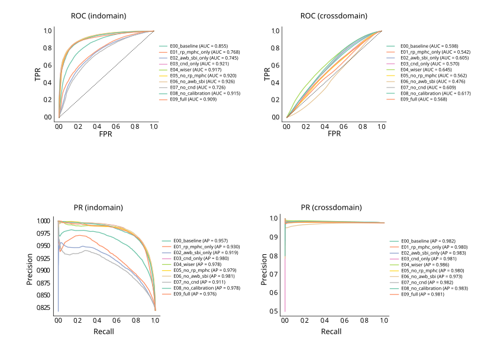

<p align="center">
<h1 align="center"><strong>WISER: Wavelet-Informed Spatial-Spectral Embedding with Refinement for Deepfake Detection</strong></h1>
  <p align="center">
    <a href='https://orcid.org/0009-0000-4104-0074' target='_blank'>Nikolai Mozgovoi </a><sup>∗</sup>&emsp;
    <a href='https://orcid.org/0000-0002-9392-3140' target='_blank'> Larissa Cherckesova </a><sup>&#8224</sup>&emsp;
    <a href='https://orcid.org/0000-0003-2433-3435' target='_blank'> Irina Trubchik </a><sup>&#8224</sup>&emsp;
    <a href='https://orcid.org/0000-0003-1577-2671' target='_blank'> Elena Revyakina </a><sup>&#8224</sup>&emsp;
    <br>
    <br>
    <sup></sup> Don State Technical University, Rostov-on-Don, Russia <sup>
    &emsp;&emsp;
    <br>
    <sup>∗</sup> Contribution&emsp;<sup>&#8224</sup> Mentorship
    <br>
  </p>
</p>

## About

<div align="center">



</div>

**WISER** (Wavelet-Informed Spatial-Spectral Embedding with Refinement) is a compact deepfake detection network designed for resource-constrained deployment. With only **270,733 trainable parameters** and inference latency under **5 ms per frame** at 256×256 resolution, WISER targets embedded systems where visual transformer-level models are infeasible due to memory, power, and latency constraints.Two-stream architecture of WISER: RGB stream with Central Difference Convolution and Bidirectional Selective State Space Mixing blocks, combined with a wavelet-defocus frequency stream via spatio-spectral cross-attention. The representation is then decomposed via Compact Nuisance Disentanglement (CND) into manipulation and method-dependent embeddings.

The core challenge in deepfake detection is the trade-off between in-domain accuracy and cross-dataset generalization. Most detectors overfit to generator-specific artifacts present in the training distribution and fail when confronted with unseen manipulation methods. WISER addresses this through frequency-domain regularization, architectural inductive biases, and representation disentanglement.

### Key Contributions

| Component | Description | Purpose |
|-----------|-------------|---------|
| **AWB-SBI** (Adaptive Wavelet-Band Self-Blending) | Frequency-domain augmentation blending pseudo-forgeries directly in wavelet sub-bands with separate low/high-frequency coefficients and gradient-activated spatial masks | Shifts pseudo-forgery spectral distribution toward real DeepFake statistics, improving cross-domain robustness |
| **RP-MPHC** (Realism-Preserving Multi-Prototype Hyperspherical Contrastive Loss) | Asymmetric margin contrastive loss with 4 learnable prototypes per class on a hypersphere, penalizing real-fake collapse more heavily in one direction | Prevents embedding space collapse of real samples during cross-dataset evaluation |
| **CND** (Compact Nuisance Disentanglement) | Linear decomposition of the joint representation into manipulation-specific and method-specific embeddings | Separates universal forgery signatures from generator-dependent artifacts |
| **CDC + BiSSM** (Central Difference Convolution + Bidirectional Selective State Space Mixing) | Gradient-aware convolution paired with linear-complexity state space modeling for global context aggregation | Captures high-frequency artifacts without quadratic attention cost |
| **Wavelet-Defocus Stream** | 12-channel Haar wavelet coefficients (LL, LH, HL, HH × R, G, B) with per-channel trainable high-frequency gating + 128×128 defocus map | Exploits frequency-domain and depth-consistency anomalies characteristic of synthetic faces |
| **Spatio-Spectral Cross-Attention** | Bidirectional cross-attention between RGB and wavelet-defocus streams | Preserves stream specialization while enabling dynamic modality fusion |

### Why These Design Choices?

<div align="center">



</div>

The progression of generative models has rendered many RGB-level artifacts obsolete. Diffusion-based face synthesis produces visually convincing results where traditional boundary artifacts or texture inconsistencies are minimal. WISER shifts the detection signal into the frequency domain, where upscaling operations, interpolation, and post-processing leave regular, statistically detectable traces in the Fourier spectrum.

The wavelet representation was chosen over global Fourier transforms because it localizes spectral anomalies in spatial sub-bands (LH, HL, HH), making them more accessible to convolutional extraction. The defocus map adds a physical forensic channel: synthesized face regions often inherit defocus properties from the source identity rather than the target scene, creating depth-of-field inconsistencies at blending boundaries.

Representation disentanglement via CND is motivated by the observation that a single embedding entangles universal manipulation signatures with generator-specific patterns. When the generator changes, the method-dependent component becomes noise. Explicit decomposition allows the classifier to rely primarily on the manipulation embedding while the method embedding can be marginalized or used for auxiliary prediction tasks.

AWB-SBI and RP-MPHC training methods for transfer from FaceForensics++ to Celeb-DF++ are discussed [here](https://github.com/vonexel/WISER/tree/wiser-research-v2).

---

## Architecture

### Module Specifications

| Module | Function | Motivation |
|--------|----------|------------|
| Central Difference Convolution (CDC) | Extracts local gradient artifacts | Fuses intensity and central-difference components for enhanced high-frequency sensitivity; parameterized by θ ∈ [0, 1] controlling interpolation between intensity and gradient (default θ = 0.7) |
| RGB branch with BiSSM blocks | Hierarchical spatial features with global mixing | Achieves global context at linear complexity O(L) via bidirectional selective scanning; motivated by absence of natural reading direction in facial images |
| Wavelet-Defocus branch | Frequency-defocus features | Wavelet localizes spectral artifacts by sub-band; defocus map captures geometric inconsistencies at manipulation boundaries |
| Spatio-Spectral Cross-Attention | Dynamic stream fusion | Preserves per-stream modality specialization while enabling mutual information exchange; feasible due to small token count (64) at fusion stage |
| CND Parameter Splitting | Decomposition of representation and classification | Factors representation into manipulation-only component z_c and method-dependent component, improving generalization |

### Parameter Budget

| Component | Approx. Parameters |
|-----------|-------------------|
| CDC initial layer + RGB branch | ~140K |
| Wavelet-Defocus branch + HF gate | ~50K |
| Cross-attention fusion | ~15K |
| CND projection + classifier | ~60K |
| Auxiliary heads | ~6K |
| **Total** | **270,733** |

---

## Datasets

### Training: FaceForensics++

FaceForensics++ serves as the primary training and in-domain evaluation benchmark. It comprises 1,000 real videos sourced from video hosting platforms and 4,000 manipulated videos across four manipulation categories:

| Category | Type | Description |
|----------|------|-------------|
| DeepFakes | Learning-based | Face replacement using autoencoder architecture |
| Face2Face | Computer graphics | Expression transfer between source and target |
| FaceSwap | Computer graphics | Identity swapping between faces |
| NeuralTextures | Learning-based | Neural texture-based reenactment |

FaceForensics++ supports configurable compression levels (c23, c40). We follow the standard video-level split protocol with fixed random seed for reproducibility.

### Cross-Dataset Evaluation: Celeb-DF++

Celeb-DF++ (2025) is a large-scale challenging benchmark for generalizable deepfake forensics. It extends Celeb-DF-v2 with 53,196 forged videos across 22 methods in three categories:

| Category | Methods | Count |
|----------|---------|-------|
| Face-Swap | Celeb-DF, SimSwap, InSwapper, HifiFace, GHOST, UniFace, MobileFaceSwap, BlendFace | 8 methods |
| Face-Reenactment | DaGAN, TPSMM, MCNET, HyperReenact, LIA, FSRT, LivePortrait | 7 methods |
| Talking-Face | SadTalker, IP-LAP, AniTalker, EDTalk, Real3D-Portrait, EchoMimic, FLOAT | 7 methods |

Celeb-DF++ was explicitly designed to test detector generalization across previously unseen generative families. The protocol trains on FaceForensics++ (HQ) and tests on Celeb-DF++ (GFD-eval).

---

## Preprocessing Pipeline

### Data Flow

Data splitting is performed at the **video level** (not frame level) to prevent identity leakage. The split is deterministic with fixed seed.

```
Raw Video → Frame Extraction → Face Detection & Alignment → Wavelet Transform + Defocus Map → RGBD Output
```

### 1. Frame Extraction
- **Sampling rate**: 1 frame per 10 video frames
- **Maximum frames**: 100 per video (avoids over-representation of long videos)
- **Format**: BGR → RGB conversion via OpenCV

### 2. Face Detection and Alignment
- **Primary detector**: MTCNN (Multi-Task Cascaded Convolutional Networks) from `facenet-pytorch`
- **Fallback detector**: OpenCV Haar Cascade
- **Output size**: 256×256 pixels
- **Functions**: Bounding box regression + 5-point facial landmark localization + head pose standardization

### 3. Wavelet Coefficient Computation (frequency stream)
- **Transform**: Single-level 2D Discrete Wavelet Transform (Haar wavelet)
- **Input**: RGB channels (3)
- **Output**: 12 channels — LL, LH, HL, HH for each of R, G, B at 128×128 resolution
- **Processing location**: Preprocessing stage (non-trainable, mathematically exact decomposition)

### 4. Defocus Map Generation
- **Method**: Local Laplacian of Intensity
- **Output**: Single-channel 128×128 map
- **Purpose**: Captures depth-of-field inconsistencies at manipulation boundaries


## Training

### Loss Function

WISER uses a hybrid multi-component loss function:

```
L_total = λ_focal · L_focal + λ_brier · L_brier + λ_rp_mphc · L_RP-MPHC + λ_spec · L_spectral + λ_aux · L_auxiliary
```

| Component | Weight | Purpose |
|-----------|--------|---------|
| **Focal Binary Cross-Entropy** (γ = 0.4) | 1.0 | Handles class imbalance; down-weights easy examples, focuses on hard samples |
| **Brier Calibration Loss** | 0.05 | Penalizes confidence miscalibration; addresses overconfidence on real samples during cross-dataset evaluation |
| **RP-MPHC Contrastive Loss** (m = 0.3) | 1.0 | Hyperspherical embedding with asymmetric margin; 4 prototypes per class; stronger penalty on real-fake collapse |
| **Spectral Alignment Loss** | 0.05 | Enforces frequency-domain consistency between RGB and wavelet streams; prevents early-training stream divergence |
| **Auxiliary Losses** (method prediction + subspace decorrelation) | 0.05 each | Drives method-dependent embedding to encode generator identity; decorrelates manipulation and method subspaces |

All loss weights are configurable via Hydra YAML files. Setting any weight to 0 enables ablation without code changes.

### Optimization

| Hyperparameter | Value |
|----------------|-------|
| Optimizer | AdamW |
| Initial learning rate | 1e-3 |
| Final learning rate | 1e-5 |
| Schedule | Cosine annealing with 5-epoch linear warmup |
| Weight decay | 0.05 |
| Batch size (training) | 96 |
| Batch size (evaluation) | 128 |
| Precision | bfloat16 mixed |
| Gradient clipping | max_norm = 1.0 |
| EMA decay | 0.9999 |
| Early stopping patience | 12 epochs (validation AUC) |
| Hardware | Single NVIDIA H100 |

### Post-Training Calibration

Temperature scaling calibration is performed on a held-out balanced validation subset after training completes. Test data is never used for calibration parameter selection (temperature, bias, threshold), ensuring no information leakage.

---

## Results

<div align="center">



</div>

### Frame-Level Results (FaceForensics++, Celeb-DF++)

| ID | Configuration | Parameters | FF++ AUC | FF++ bAcc | CDF++ AUC | CDF++ bAcc | CDF++ Real Recall |
|:--:|:-------------|:----------:|:--------:|:---------:|:---------:|:----------:|:-----------------:|
| E00 | Baseline (Bayar-Stamm + ECA) | 698,155 | 0.855 | 0.742 | 0.598 | 0.566 | 0.320 |
| E01 | Only RP-MPHC | 269,249 | 0.768 | 0.692 | 0.542 | 0.522 | 0.415 |
| E02 | Only AWB-SBI | 269,249 | 0.745 | 0.658 | 0.605 | 0.556 | 0.194 |
| E03 | Only CND | 270,733 | 0.921 | 0.838 | 0.570 | 0.548 | 0.415 |
| **E04** | **WISER (full)** | **270,733** | **0.917** | **0.839** | **0.645** | **0.591** | **0.364** |
| E05 | WISER without RP-MPHC | 270,733 | 0.920 | 0.837 | 0.562 | 0.539 | 0.277 |
| E06 | WISER without AWB-SBI | 270,733 | 0.926 | 0.817 | 0.476 | 0.518 | 0.149 |
| E07 | WISER without CND | 269,249 | 0.726 | 0.651 | 0.609 | 0.571 | 0.235 |
| E08 | WISER without calibration | 270,733 | 0.915 | 0.787 | 0.617 | 0.581 | 0.288 |
| E09 | WISER with weighted AWB-SBI | 270,733 | 0.909 | 0.780 | 0.568 | 0.542 | 0.306 |

### Key Observations

- **AWB-SBI is the strongest single contributor** to cross-domain transfer: removing it (E06) drops CDF++ AUC from 0.645 to 0.476 — the most dramatic ablation signal, indicating severe shortcut learning without frequency regularization.
- Even in isolation (E02), AWB-SBI alone achieves CDF++ AUC 0.605, approaching the full baseline (E00: 0.598) with **2.6× fewer parameters**.
- **RP-MPHC** primarily benefits the real class: its removal (E05) drops real recall from 0.364 to 0.277, confirming its role in preventing real-sample embedding collapse.
- **CND** changes error geometry rather than uniformly improving metrics: without it (E07), fake recall jumps to 0.953 while real recall drops to 0.235, revealing a precision-recall tradeoff controlled by disentanglement.
- Full WISER (E04) simultaneously outperforms the baseline on cross-domain metrics **and** uses **2.6× fewer parameters** (270K vs 698K).

### Video-Level Results (Celeb-DF++)

| ID | AUC | bAcc | Real Recall | Fake Recall |
|:--:|:---:|:----:|:-----------:|:-----------:|
| E00 (Baseline) | 0.671 | 0.554 | 0.243 | 0.864 |
| **E04 (WISER)** | **0.668** | **0.580** | **0.296** | **0.865** |
| E06 (no AWB-SBI) | 0.440 | 0.498 | 0.071 | 0.925 |
| E07 (no CND) | 0.631 | 0.542 | 0.130 | 0.953 |

E08 (no calibration) achieves higher video AUC (0.700) because AUC depends only on ranking order, which temperature scaling preserves; however, E04 achieves higher balanced accuracy (0.580 vs 0.560) because calibration improves threshold-dependent metrics.

### Comparison with Related Methods

| Model | Parameters | Dataset | AUC | Notes |
|:------|:----------:|:-------:|:---:|:------|
| EfficientNet-B4 | ~19M | Celeb-DF | 0.700 | Frame-level |
| F3-Net | ~4.2M | Celeb-DF | 0.650 | Frame-level |
| SBI | ~4.1M | Celeb-DF | 0.930 | Video-level |
| FSBI | ~5.8M | Celeb-DF | 0.955 | Video-level |
| **WISER (Frame)** | **270,733** | **Celeb-DF++** | **0.645** | Frame-level |
| **WISER (Video)** | **270,733** | **Celeb-DF++** | **0.668** | Video-level |

Direct comparison is indicative: competitor results are on Celeb-DF, while WISER reports on the more challenging Celeb-DF++ benchmark with 22 unseen methods across Face-Swap, Reenactment, and Talking-Face categories.

### Inference Performance

| Metric | Value |
|--------|-------|
| Parameters | 270,733 |
| Input resolution | 256 × 256 |
| Inference latency | ≤ 5 ms/frame |
| Target platform | Resource-constrained / embedded systems |

---

## Ablation Study Design

All ablation experiments are configured via individual Hydra YAML files:

| Experiment | Purpose |
|:-----------|:--------|
| E00 | Baseline with Bayar-Stamm constrained convolution + ECA attention |
| E01 | Isolation test: RP-MPHC loss only |
| E02 | Isolation test: AWB-SBI augmentation only |
| E03 | Isolation test: CND disentanglement only |
| E04 | **Full WISER configuration** |
| E05 | Ablation: remove RP-MPHC |
| E06 | Ablation: remove AWB-SBI |
| E07 | Ablation: remove CND |
| E08 | Ablation: remove post-training calibration |
| E09 | Variant: gradient-adaptive AWB-SBI band weighting |

Stable cross-domain transfer is achieved only when all components are used jointly, confirming their functional complementarity.

---

## Limitations

1. **Face detector dependency**: The entire preprocessing pipeline relies on MTCNN. Face detection failures in the alignment stage propagate to systematic classification errors.

2. **No temporal modeling**: The architecture processes frames independently. Reenactment and Talking-Face manipulations manifest primarily in temporal inconsistencies (articulation-speech misalignment, temporal flicker) that frame-level analysis cannot capture.

3. **Real-class recall ceiling**: Even the best configuration achieves only 0.364 real recall on Celeb-DF++. The model reliably detects fakes but systematically misclassifies genuine out-of-domain frames as forged. This reflects a persistent dataset bias that architectural constraints alone cannot fully resolve.

4. **Adaptive weighting instability**: E09 (gradient-adaptive AWB-SBI band weights) underperforms static weighting, likely because the gradient signal is too noisy in early training epochs for reliable band importance estimation.

---

## Project Structure

```
WISER/
├── assets/                    # Static visual assets (SVG figures, logos)
├── conf/                      # Hydra configuration directory
│   ├── augment/               # Augmentation strategy configs
│   ├── data/                  # Dataset and data loading configs
│   ├── experiment/            # Ablation experiment configs (E00–E09)
│   ├── loss/                  # Loss function component configs
│   ├── model/                 # Model architecture configs
│   ├── training/              # Training hyperparameter configs
│   └── config.yaml            # Root Hydra configuration
├── outputs/                   # Training outputs and checkpoints
│   └── E04_wiser/
│       └── 0/                 # Hydra run directory for experiment E04
├── scripts/                   # Executable entry-point scripts
├── video_examples/            # Sample videos for demo/testing
│   ├── fake/                  # Example deepfake videos
│   └── real/                  # Example authentic videos
├── wiser/                     # Main Python package
│   ├── configs/               # Python configuration schemas
│   ├── data/                  # Data loading, preprocessing, augmentation
│   ├── evaluation/            # Metrics and evaluation logic
│   ├── inference/             # Inference and prediction pipeline
│   ├── models/                # Neural network architecture modules
│   ├── training/              # Training loop, optimizers, callbacks
│   └── utils/                 # Utility functions (I/O, logging, reproducibility)
├── app.py                     # Streamlit demo application
├── pyproject.toml             # Project dependencies and metadata
├── README.md                  # Project documentation
├── LICENSE                    # MIT License
└── .gitignore                 # Git ignore rules
```

---

## Quick Start

### Requirements
- Python 3.9+
- CUDA 11.8+ (recommended for GPU training)
- 8GB+ GPU memory (for training)
- 4GB+ GPU memory (for inference)

### Setup

```bash
# Clone repository
git clone https://github.com/vonexel/WISER.git
cd WISER
```

```bash
# Base install
uv sync --extra dev

# (Optional, Add Mamba-ssm: H100 support-only) 
uv pip install --no-build-isolation causal-conv1d mamba-ssm
```

## Usage

### Data Preparation

1. **Download FaceForensics++**: Request access at [https://github.com/ondyari/FaceForensics](https://github.com/ondyari/FaceForensics) and download the dataset.

2. **Download Celeb-DF++++**: Request access at [https://github.com/OUC-VAS/Celeb-DF-PP](https://github.com/OUC-VAS/Celeb-DF-PP) and download the dataset.

3. **Run preprocessing**: 
```bash
# Preprocess (idempotent, video-level, cached on disk)
uv run python scripts/preprocess_ffpp.py --raw_root dataset/ff_c23 --cache_root preprocessed
uv run python scripts/preprocess_celebdfpp.py --raw_root dataset/celebdfpp --cache_root preprocessed
```

This extracts faces, computes Haar wavelet coefficients (12 channels), and generates defocus maps (1 channel, 128×128).

### Training & Evaluation

Run One Experiment:

```bash
# Train one experiment
uv run python scripts/train.py experiment=E04_wiser seed=0
```

Run the Full Ablation Sweep:

```bash
# Run the full ablation sweep
bash scripts/run_ablation.sh
```

### Run Interface

```bash
# Start the streamlit-interface
streamlit run app.py
```

---

## Training Logs and Checkpoints

| Experiment | Config | Weights | Metrics |
|:-----------|:------:|:-------:|:----:|
| **E04** | **[yaml](conf/experiments/E04_wiser_rf_full.yaml)** | **[pt](outputs/E04_wiser/0/ckpt/best.pt)** | **[metrics](outputs/E04_wiser/0/metrics.json)** |

---

## Citation

If you find this work useful, please cite:

```bibtex
@article{mozgovoi2026wiser,
  title={Wavelet-Informed Spatial-Spectral Embedding with Refinement for Deepfake Detection},
  author={Mozgovoi, Nikolai V. and Cherckesova, Larisa V. and Trubchik, Irina S. and Revyakina, Elena A.},
  journal={},
  year={2026},
  publisher={},
  note={Code available at \url{https://github.com/vonexel/WISER}}
}
```

If you use the FaceForensics++ dataset, please also cite:

```bibtex
@inproceedings{rossler2019faceforensics,
  title={FaceForensics++: Learning to Detect Manipulated Facial Images},
  author={R{\"o}ssler, Andreas and Cozzolino, Davide and Verdoliva, Luisa and Riess, Christian and Thies, Justus and Niessner, Matthias},
  booktitle={IEEE/CVF International Conference on Computer Vision (ICCV)},
  year={2019}
}
```

If you use the Celeb-DF++ benchmark, please cite:

```bibtex
@article{li2025celeb,
  title={Celeb-DF++: A Large-scale Challenging Video DeepFake Benchmark for Generalizable Forensics},
  author={Li, Yuezun and Zhu, Delong and Cui, Xinjie and Lyu, Siwei},
  journal={arXiv preprint arXiv:2507.18015},
  year={2025}
}

@inproceedings{li2020celeb,
  title={Celeb-DF: A Large-scale Challenging Dataset for Deepfake Forensics},
  author={Li, Yuezun and Yang, Xin and Sun, Pu and Qi, Honggang and Lyu, Siwei},
  booktitle={IEEE Conference on Computer Vision and Pattern Recognition},
  year={2020}
}
```

---

## Acknowledgments

We thank the authors of FaceForensics++ and Celeb-DF++ for establishing standardized benchmarks that enable meaningful comparison in deepfake detection research.

---

## License

This project is licensed under the MIT License. See [LICENSE](LICENSE) for details.

Note that the FaceForensics++ and Celeb-DF++ datasets are subject to their own licensing terms, which must be observed independently of the code license.

---

## Contact

For questions regarding the code or the paper:

- **Nikolai Mozgovoi** (primary author): nmozgovoi@outlook.com
- **ORCID**: [0009-0000-4104-0074](https://orcid.org/0009-0000-4104-0074)
- **Institution**: Don State Technical University, 1 Gagarin Square, Rostov-on-Don 344000, Russia

For issues, bug reports, or contributions, please open a GitHub issue.