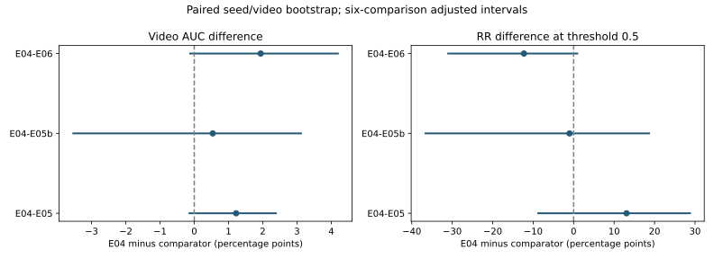

<p align="center">
<h1 align="center"><strong>WISER: AWB-SBI and RP-MPHC Cross-Dataset Deepfake Detection </strong></h1>
  <p align="center">
    <a href='https://orcid.org/0009-0000-4104-0074' target='_blank'>Nikolai Mozgovoi </a><sup>∗</sup>&emsp;
    <a href='https://orcid.org/0000-0002-9392-3140' target='_blank'> Larissa Cherckesova </a><sup>&#8224</sup>&emsp;
    <a href='https://orcid.org/0000-0003-2433-3435' target='_blank'> Irina Trubchik </a><sup>&#8224</sup>&emsp;
    <a href='https://orcid.org/0000-0003-1577-2671' target='_blank'> Elena Revyakina </a><sup>&#8224</sup>&emsp;
    <br>
    <br>
    <sup></sup> Don State Technical University, Rostov-on-Don, Russia <sup>
    &emsp;&emsp;
    <br>
    <sup>∗</sup> Contribution&emsp;<sup>&#8224</sup> Mentorship
    <br>
  </p>


## About

**Research focus: AWB-SBI and RP-MPHC training methods for transfer from FaceForensics++ to Celeb-DF++.**

[WISER](https://github.com/vonexel/WISER) (Wavelet-Informed Spatial-Spectral Embedding with Refinement) is a compact detector and an experimental platform for studying deepfake detection under dataset shift. The current study asks whether wavelet-band self-blending and prototype-based contrastive regularization improve performance on unseen external data when the detector architecture and the rest of the training pipeline are held fixed.

## What we investigate

1. **AWB-SBI:** does mixing within Haar wavelet sub-bands improve external detection compared with otherwise matched RGB self-blending?
2. **RP-MPHC:** does the additional real-preserving term help, and does the complete contrastive block improve transfer compared with disabling it?
3. **Mechanisms:** do synthetic blends approach the spectra of observed forgeries, and do learned representations actually use multiple prototypes?
4. **Calibration:** how does calibration fitted only on source-domain data affect external reliability and operating-point behavior?

The main evaluation direction is **train on FaceForensics++ (FF++), test on Celeb-DF++**. Strong FF++ performance alone does not answer these questions. Celeb-DF++ is used for external evaluation, not for training, checkpoint selection, calibration fitting, or threshold selection.

## Methods and fixed detector

### AWB-SBI: adaptive wavelet-band self-blending

AWB-SBI constructs a pseudo-forgery from a genuine face crop and a transformed version of the same crop. It applies a single-level Haar transform and mixes the bands separately:

- **LL:** restrained global mixing with coefficient `alpha_ll = 0.15`.
- **LH, HL, HH:** spatial mixing through a feathered landmark mask, strengthened at high-gradient locations with `energy_boost = 1.5`.
- **Reconstruction:** inverse Haar transform followed by clipping and quantization. This does not guarantee exact preservation of the output LL band.

During training, pseudo-generation probability is **0.5** and the pseudo-fake target is **0.7**. Soft pseudo-examples are excluded from both contrastive anchors and in-batch negative candidates. The RGB-SBI control uses the same probability, target, and exclusion policy, so the comparison isolates the blending formulation.

### RP-MPHC: contrastive regularization with real-preserving margins

MPHC operates on normalized 192-dimensional embeddings with **four learnable prototypes per class**. It combines attraction to the nearest same-class prototype with separation from opposite-class prototypes and hard batch negatives.

The RP term adds a genuine-class margin penalty. It uses `real_delta = 0.4` and gives the hardest quarter of genuine examples twice the weight of other genuine examples. The base MPHC margin is **0.35**, temperature **0.07**, and hard-negative weight **0.1**. The complete contrastive term has weight **0.5** in the training objective; RP has weight **0.5** within that term.

Prototype parameters belong to the loss module, are included in the optimizer, and are saved alongside the detector state. At `K = 4`, they add **1,536 training-only parameters**. Their intended role is a hypothesis to test; allocating four prototypes does not demonstrate that all four are used.

### Backbone held constant across the main series

The detector has **270,733 parameters**, takes **256 x 256** RGB crops, and combines:

- an RGB stream with central-difference convolution and the explicitly selected `LinearAttention2DAsToken` backend;
- a frequency stream using 12 Haar channels and a Laplacian-based sharpness/defocus proxy;
- spatial-spectral cross-attention and Compact Nuisance Disentanglement (CND).

The completed series uses the **`linear` backend**. These results are not evidence for an executed Mamba selective-state-space model. The Laplacian input is a sharpness proxy, not measured depth. Architecture, CND, and the other regularizers remain fixed in the main comparisons.

## Experimental design

### Four configurations, three matched seeds

Each configuration was trained with seeds **0, 1, and 2**, giving **12 completed scientific runs** under protocol `prospective-all-local-v1`.

| ID | Self-blending | Base MPHC | RP term | Comparison with E04 |
|---|---|---|---|---|
| **E04** | AWB-SBI | Enabled | Enabled | Full configuration |
| **E05** | AWB-SBI | Enabled | Disabled | Contribution of RP alone |
| **E05b** | AWB-SBI | Disabled | Disabled | Contribution of the entire contrastive block |
| **E06** | Matched RGB-SBI | Enabled | Enabled | Contribution of wavelet-band blending |

In this series, **E05 disables only RP**. E05b is the control without the complete contrastive block. Historical experiments used different configurations and must not be identified solely by a reused experiment number.

### Data and preprocessing

The local FF++ c23 inventory contains **1,000 genuine and 5,000 forged videos**, with Deepfakes, Face2Face, FaceSwap, NeuralTextures, and the additional FaceShifter set. Manipulated source/target pairs are grouped before splitting, keeping both original video IDs in the same partition.

| Partition | Genuine videos | Forged videos | Accepted frames |
|---|---:|---:|---:|
| FF++ training | 720 | 3,600 | 204,668 |
| FF++ checkpoint validation | 70 | 350 | 19,036 |
| FF++ calibration | 70 | 350 | 19,468 |
| FF++ test | 140 | 700 | 41,213 |
| Celeb-DF++ external | 890 | 53,196 | 1,581,355 |
| **Total** | **1,890** | **58,196** | **1,865,740** |

The external genuine pool contains **590 Celeb-real and 300 YouTube-real videos**. The forged pool covers **22 methods**. This is an explicitly defined **all-local external protocol**; its pooled score is not asserted to reproduce the benchmark authors' exact GFD-eval subset or aggregation.

Preprocessing selects every tenth frame, up to 100 selected frames per video, crops the largest MTCNN face, and stores 256 x 256 JPEG crops at quality 95. There is no landmark alignment warp. Landmarks for self-blending are cached on decoded genuine crops; Haar and sharpness inputs are recomputed after image transformations during loading. SBI and AWB-SBI are generated online.

The frozen manifest covers **60,086 videos**, with no completely omitted videos. Individual rejected frames are recorded in preprocessing reports. The source grouping prevents overlap of the linked original video IDs; it is not an independently verified human-identity split or a cross-dataset deduplication guarantee.

### Shared training settings

| Setting | Value |
|---|---|
| Optimizer | AdamW, learning rate `3e-4`, weight decay `0.05`; no decay on prototypes |
| Schedule | Up to 100 epochs; 5-epoch warmup; cosine decay to `1e-6` |
| Batch sizes | 96 training / 128 evaluation |
| Precision and clipping | BF16; gradient norm limited to 1.0 |
| EMA | Decay `0.9999` |
| Checkpoint selection | Maximum FF++ validation **EMA frame AUC** |
| Early stopping | Patience 10 epochs |
| Sampling per epoch | 16 real/fake pairing rounds; 23,040 samples, 240 batches |
| Classification loss | Alpha-weighted BCE: `alpha = 0.4`, `gamma = 0` |

The remaining Brier, frequency, CND, and orthogonality terms are held fixed. Exact settings are in [research/configs/E04.yaml](research/configs/E04.yaml) and each run's `config_resolved.yaml`.

### Evaluation and uncertainty

- **Co-primary endpoints:** external video ROC-AUC and genuine-class recall (**RR**) at raw probability threshold **0.5**. Forged videos have label 1.
- **Video score:** mean of the frame probabilities for that video. **FR** is forged-class recall; **bAcc = (RR + FR) / 2**.
- **Secondary outputs:** frame metrics, Brier score, 15-bin ECE, per-method video AUC, and method-macro AUC.
- **Uncertainty:** 10,000 paired, class-stratified video-bootstrap replicates, with paired training seeds additionally resampled in the hierarchical analysis.
- **Multiplicity:** three contrasts times two co-primary endpoints. Bonferroni-adjusted intervals use 99.1667% individual coverage for a 95% familywise target.
- **Joint success rule:** both adjusted intervals for a contrast must lie above zero. An interval spanning zero is inconclusive; it does not establish equivalence.

Only three training seeds are available. Their uncertainty is imprecisely estimated, and a video-only interval that fixes the trained models cannot replace repeated training. The primary analysis resamples videos, not independently verified identity clusters.

## Results of the completed series

### External performance: FF++ to Celeb-DF++

Values are **mean +/- sample standard deviation across three seeds**, on the 0-1 scale. All results in this table use raw mean-video probabilities and threshold 0.5. Standard deviations are not confidence intervals.

| Configuration | Video AUC | Genuine recall (RR) | Forged recall (FR) | Balanced accuracy |
|---|---:|---:|---:|---:|
| **E04: AWB-SBI + MPHC + RP** | **0.6786 +/- 0.0154** | 0.5828 +/- 0.1690 | 0.6526 +/- 0.1463 | 0.6177 +/- 0.0131 |
| E05: without RP | 0.6664 +/- 0.0139 | 0.4521 +/- 0.0388 | 0.7409 +/- 0.0346 | 0.5965 +/- 0.0091 |
| E05b: without the contrastive block | 0.6732 +/- 0.0245 | 0.5929 +/- 0.1259 | 0.6466 +/- 0.0954 | 0.6197 +/- 0.0235 |
| E06: matched RGB-SBI | 0.6592 +/- 0.0073 | 0.7056 +/- 0.0370 | 0.5335 +/- 0.0214 | 0.6195 +/- 0.0091 |

E04 reaches **0.9884 +/- 0.0026** video AUC on the held-out FF++ test partition. Its external AUC of **0.6786 +/- 0.0154** shows that a substantial transfer gap remains.

### Controlled effects and adjusted intervals

Differences are **E04 minus the comparator**. Positive values favor E04 for that endpoint. Brackets contain the multiplicity-adjusted hierarchical intervals described above.

| Contrast | AUC difference [adjusted interval] | RR difference [adjusted interval] |
|---|---:|---:|
| E04 - E05: add RP | +0.0122 [-0.0017, +0.0241] | +0.1307 [-0.0899, +0.2899] |
| E04 - E05b: add the complete contrastive block | +0.0054 [-0.0356, +0.0314] | -0.0101 [-0.3685, +0.1888] |
| E04 - E06: replace RGB-SBI with AWB-SBI | +0.0194 [-0.0015, +0.0422] | -0.1228 [-0.3124, +0.0112] |

**Interpretation:** the full model has the largest mean AUC, but every adjusted co-primary interval includes zero. No contrast meets the joint success rule. Against RGB-SBI, AWB-SBI increases mean AUC by **1.94 percentage points** while reducing genuine recall by **12.28 percentage points**; genuine recall is lower in all three paired runs. E04 also does not have the highest mean balanced accuracy. These results support a measured trade-off and further investigation, not a confirmed overall transferability gain.

The complete numerical source, including ordinary 95% intervals and individual seed differences, is [research/results/comparisons.json](research/results/comparisons.json).

<div align="center">



</div>


### Spectral mechanism

The completed mechanism study compares genuine FF++ crops, observed FF++ and Celeb-DF++ forgeries, RGB-SBI, and AWB-SBI. It uses 140 genuine source videos, 100 FF++ forged videos, 440 external forged videos, and five frames per video. Synthetic variants are paired by source; generation is forced for this analysis rather than using the training probability of 0.5.

Compared with RGB-SBI, AWB-SBI:

- **reduces LL perturbation:** mean LL-MSE difference `-0.00700`, exploratory 95% interval `[-0.00753, -0.00651]`;
- **increases high-frequency energy**, while low- and mid-frequency energy decrease;
- reduces low- and mid-band L1 profile distance to external forgeries, but **increases full-profile L1 distance** by `+0.1116`, interval `[+0.0953, +0.1280]`.

Thus, restrained LL disturbance and increased high-frequency energy are supported, but general spectral matching to observed forgeries is not. These exploratory mechanism results do not establish detection efficacy. Definitions, samples, bootstrap outputs, SVG, and PNG are in [research/results/spectral/](research/results/spectral/).

### Prototype diagnostics

Across all nine runs with MPHC, nearest-prototype video assignments use **one prototype per class** on validation, FF++ test, and external data. Four prototypes are allocated, but the diagnostic does not demonstrate useful multi-prototype coverage. This concerns assignment usage; it does not by itself prove that the prototype vectors are identical.

The diagnostics compare saved EMA video embeddings with the checkpoint's learned loss prototypes. They are not the detector's inference decision rule. A controlled `K = 1` comparison is still needed to establish a benefit from multiple prototypes. See each run's `geometry_diagnostics.json` and `figures/prototype_*.svg`.

### Source-only calibration

Temperature and bias are fitted by video-balanced frame NLL on the separate FF++ calibration partition. Secondary operating thresholds are also chosen there. Calibration is applied to frame logits before mean-video pooling.

For E04, mean external video **Brier score decreases from 0.2235 to 0.1212**, and **ECE from 0.3723 to 0.2556**. These are descriptive secondary results, separate from the raw-threshold primary comparisons. Because nonlinear calibration precedes averaging, video rankings and video AUC can change even though the monotonic transform preserves frame ranking.

The external set is heavily imbalanced: **53,196 of 54,086 videos are forged**. Aggregate calibration scores must therefore be interpreted alongside genuine-class performance. The historical E08r calibration finding came from different models and conditions and is not pooled with this series.

## Evidence, provenance, and research limits

All 12 run status files report `complete` and `scientific_use_allowed: true`. Each run retains its resolved configuration, environment, passport, selected checkpoint, epoch history, predictions, metrics, and artifact hashes. The frozen data manifest SHA-256 is:

```text
dc66dfacceca6c78a572760222295a77461aaa6830400629d32e11dadf59e5e2
```

The corrected protocol includes trainable loss prototypes in the optimizer, fully excludes soft pseudo-examples from contrastive computations, matches the RGB-SBI control, selects EMA checkpoints consistently, and recomputes forensic inputs after image transformations.

The present study is limited to one fixed backbone, one transfer direction, and three seeds per arm. It does not establish component synergy, backbone-independent gains, superiority to published SBI/FSBI systems, or deployment readiness. RGB-SBI here is a matched WISER control, not a reproduction of a complete published detector. The model processes frames independently and does not test temporal modeling.

## Reproducing the study

 Use the **`research.tools` workflow** for this study; the legacy `scripts/` and `conf/` entry points implement earlier experiments. Run commands from the project root.
Preprocess raw videos once, either locally or on the server. The commands below use **Bash on Linux or WSL**.

### 1. Preprocess raw videos

Obtain FF++ c23 and Celeb-DF++ under their dataset access terms. Place the raw videos under `datasets/`, preserving the paths in the supplied `research/data/videos.csv`:

```text
datasets/
  ff_c23/FaceForensics++_C23/
    original/                       # Genuine FF++ videos
    Deepfakes/
    Face2Face/
    FaceSwap/
    NeuralTextures/
    FaceShifter/
  celebdfpp/
    Celeb-real/
    YouTube-real/
    Celeb-synthesis/
      FaceReenact/<method>/
      FaceSwap/<method>/
      TalkingFace/<method>/
```

The supplied `videos.csv` already fixes the inventory and source-disjoint partitions. Keep it unchanged for this reproduction.

In **Bash**, enter your local project directory (replace `/path/to/WISER` with your actual path) and create a dedicated Python 3.11 environment:

```bash
cd "/path/to/WISER"
python3.11 -m venv .venv-preprocess
```

Install the pinned CUDA 12.4 PyTorch wheels if using an NVIDIA GPU with a compatible driver:

```bash
./.venv-preprocess/bin/python -m pip install torch==2.5.1 torchvision==0.20.1 --index-url https://download.pytorch.org/whl/cu124
```

For CPU preprocessing, use this command instead and replace `--device cuda` with `--device cpu` in both crop commands below:

```bash
./.venv-preprocess/bin/python -m pip install torch==2.5.1 torchvision==0.20.1 --index-url https://download.pytorch.org/whl/cpu
```

Install and check the remaining preprocessing dependencies in this dedicated environment:

```bash
./.venv-preprocess/bin/python -m pip install -r research/linux/requirements-preprocess.txt
./.venv-preprocess/bin/python -m pip check
./.venv-preprocess/bin/python -c "import torch; print(torch.__version__); print('CUDA available:', torch.cuda.is_available())"
```

Run a four-video smoke test. MTCNN and face-alignment weights may download on first use.

```bash
./.venv-preprocess/bin/python -m research.tools.prepare_data crop --raw-root datasets --out research/data --device cuda --limit 4
```

Inspect representative images in `research/data/crops/` and the report `research/data/crop_report_smoke.json`. This checks the detector pipeline on the first four videos; it is not a quality audit of every manipulation method. Then process the full inventory:

```bash
./.venv-preprocess/bin/python -m research.tools.prepare_data crop --raw-root datasets --out research/data --device cuda
```

Preprocessing samples every tenth frame, up to 100 frames per video, and saves the largest detected face as a 256 x 256 JPEG at quality 95. Genuine-crop landmarks are cached for self-blending. Missing faces or landmarks are recorded as failures. Wavelet and sharpness tensors are recomputed during loading, and SBI/AWB-SBI remain online training augmentations; neither needs a separate generated dataset.

Keep the preprocessing environment and script fixed throughout the corpus. An interrupted crop job reuses completed per-video shards only when their inventory and recorded environment match. Once the output manifest exists, cropping refuses to overwrite it. Inspect `research/data/crop_report.json`, including failures by class/method and completely omitted videos, before freezing the data:

```bash
./.venv-preprocess/bin/python -m research.tools.audit_data --manifest research/data/frames.csv
```

The audit verifies crop/landmark hashes and source separation, then writes `data_freeze.json`. It stops if a video has no accepted frames. Investigate those failures before documenting any explicit `--exclusion-reason`; the reported series has no omitted videos, and a changed exclusion set is a different data protocol.

Package the audited data separately from the code:

```bash
./.venv-preprocess/bin/python -m research.tools.package_data
```

This creates `delivery/wiser-preprocessed.tar` and its `.sha256` sidecar, including crops, landmarks, manifests, reports, and progress shards with portable relative paths. It keeps the source data and refuses to overwrite an existing archive; use a new `--output` filename for a new package.

### 2. Transfer and verify the archives

The archive route requires `wiser-paper2-linux.tar.gz` (code) and, if preprocessing is complete, `wiser-preprocessed.tar` (data), each with its SHA-256 sidecar. The code archive excludes generated crops and landmarks. From the local project root, transfer them in Bash, replacing `USER` and `HOST` and adapting `/home/ubuntu` to an existing server work directory:

```bash
scp delivery/wiser-paper2-linux.tar.gz delivery/wiser-paper2-linux.tar.gz.sha256 USER@HOST:/home/ubuntu/
scp delivery/wiser-preprocessed.tar delivery/wiser-preprocessed.tar.sha256 USER@HOST:/home/ubuntu/
ssh USER@HOST
```

All following commands use **Bash on Linux**. The documented target is Linux x86_64, Python 3.11 with `venv`, and one NVIDIA H100 or another GPU that passes the batch-96 BF16 preflight. Dependency installation needs network access. The recorded data tar is about 32.5 GB and contains about 29.0 GB of files, roughly 1.98 million files in total. Allow more than 62 GB for archive plus extracted data, with substantial extra SSD space for the environment, filesystem metadata, checkpoints, predictions, and results. Check both free space and inodes:

```bash
cd /home/ubuntu
set -euo pipefail
nvidia-smi
free -h
df -h .
df -i .
sha256sum -c wiser-paper2-linux.tar.gz.sha256
sha256sum -c wiser-preprocessed.tar.sha256
```

Use a fresh project directory. `mkdir` intentionally fails if it already exists; inspect the previous project before choosing another destination. Extract code and verify its internal checksums **before** extracting data, which supplies its own frozen `research/data/` files:

```bash
mkdir /home/ubuntu/WISER
tar -xzf /home/ubuntu/wiser-paper2-linux.tar.gz -C /home/ubuntu/WISER
cd /home/ubuntu/WISER
mkdir server_logs_reproduction
sha256sum -c SHA256SUMS | tee server_logs_reproduction/code-integrity.log
tar -xf /home/ubuntu/wiser-preprocessed.tar -C /home/ubuntu/WISER
ls -lh research/data/frames.csv research/data/videos.csv research/data/data_freeze.json
```

The archives contain project-relative paths, without an outer `WISER/` folder. Data extraction and auditing can take a long time because of the file count. For long server sessions, optionally use `tmux new -s wiser-reproduction` before setup; reconnect with `tmux attach -t wiser-reproduction`.

If preprocessing on the server instead, transfer the code archive and raw `datasets/` only, skip the prepared-data checksum/extraction commands, and place `datasets/` inside the extracted project. Complete environment setup below before running the crop commands in step 4. If the project and prepared data are already present, start at step 3; do not extract archives over existing results or rerun cropping.

### 3. Set up the Linux environment

Run from `/home/ubuntu/WISER` (or your chosen project root). Check that `python3.11 --version` succeeds. If Python 3.11 is missing and `uv` is available, install a user-managed interpreter and expose it in the current shell:

```bash
export PATH="$HOME/.local/bin:$PATH"
uv python install 3.11
python3.11 --version
```

Once Python 3.11 is available, install the pinned Linux environment:

```bash
cd /home/ubuntu/WISER
set -euo pipefail
mkdir -p server_logs_reproduction
bash research/linux/setup.sh 2>&1 | tee server_logs_reproduction/setup.log
```

The script creates `.venv`, installs the hash-locked dependencies (PyTorch 2.5.1 / CUDA 12.4), runs `pip check` and `research/tests`, and records `research/linux/installed-freeze.txt`. Keep these versions fixed across all runs. Mamba installation is not required: the series uses the `linear` backend.

Activate the environment and set the execution variables. Repeat this block after opening a new shell:

```bash
cd /home/ubuntu/WISER
set -euo pipefail
source .venv/bin/activate
export PYTHONPATH="$PWD${PYTHONPATH:+:$PYTHONPATH}"
export CUBLAS_WORKSPACE_CONFIG=:4096:8
export NO_ALBUMENTATIONS_UPDATE=1
export CUDA_VISIBLE_DEVICES=0
export WISER_PROGRESS=1
```

```bash
python -m pip check
python -c "import torch; assert torch.cuda.is_available(), 'CUDA unavailable'; assert torch.cuda.is_bf16_supported(), 'BF16 unavailable'; print(torch.__version__, torch.version.cuda, torch.cuda.get_device_name(0))"
```

### 4. Audit the data and check GPU capacity

**Only when preprocessing was not already completed**, run these commands separately with raw videos under `datasets/` and the original inventory in `research/data/videos.csv`:

```bash
python -m research.tools.prepare_data crop --raw-root datasets --out research/data --device cuda --limit 4
```

Inspect the smoke crops/report, then run:

```bash
python -m research.tools.prepare_data crop --raw-root datasets --out research/data --device cuda
```

For either data route, inspect the full crop report and audit all files after preparation or transfer:

```bash
python -m research.tools.audit_data --manifest research/data/frames.csv 2>&1 | tee server_logs_reproduction/data-audit.log
```

For the exact prepared dataset used in the reported series, verify the frozen counts and manifest hashes:

```bash
python - <<'PY'
import json
from pathlib import Path
f = json.loads(Path('research/data/data_freeze.json').read_text())
assert f['content_hashes_verified']
assert f['frames'] == 1865740 and f['videos'] == 60086
assert not f['omitted_videos']
assert f['manifest_sha256'] == 'dc66dfacceca6c78a572760222295a77461aaa6830400629d32e11dadf59e5e2'
assert f['videos_sha256'] == '57c2adbbf6b750202c3761c6610e7234d64741f0a19002e2923947736280fc38'
print('Verified:', f['videos'], 'videos;', f['frames'], 'frames')
PY
```

Reprocessed crops may differ from this frozen dataset; record that difference rather than claiming identical inputs. Check the actual training batch size before launching experiments:

```bash
python -m research.tools.preflight --batch-size 96 \
  --output research/results_reproduction/preflight.json \
  2>&1 | tee server_logs_reproduction/preflight.log
```

Preflight checks BF16, a training step, and GPU memory using synthetic input; it does not estimate full training time including data I/O. If batch 96 does not fit, use a suitable GPU or establish a common revised protocol for every arm. Do not reduce batch size or precision for individual variants.

### 5. Run the synthetic end-to-end smoke test

The commands below use fresh reproduction output directories, preserving the completed results in `research/runs/` and `research/results/`. If repeating a previous reproduction attempt, choose new output directories consistently throughout the remaining steps.

```bash
python -m research.tools.smoke_fixture
PYTHONHASHSEED=0 python -m research.tools.train \
  --experiment E04 --seed 0 --manifest research/tests/fixture/frames.csv \
  --workers 0 --smoke --out-root research/server_smoke_reproduction \
  2>&1 | tee server_logs_reproduction/smoke.log
```

```bash
python - <<'PY'
import json
from pathlib import Path
s = json.loads(Path('research/server_smoke_reproduction/E04_SMOKE/0/status.json').read_text())
assert s['status'] == 'complete', s
assert s['scientific_use_allowed'] is False, s
print('Synthetic smoke passed')
PY
```

This exercises training, validation, source calibration, evaluation, and output generation. Its metrics and smoke-labelled figures are software checks, not research results.

### 6. Repeat the 12 main experiments

Run the following commands **one at a time**, waiting for successful completion before starting the next. They use `research/data/frames.csv` by default. Each run automatically fits source-only calibration, evaluates FF++ test and Celeb-DF++ external data, and saves predictions, metrics, and figures; a separate cross-dataset evaluation command is unnecessary.

**E04: AWB-SBI + MPHC + RP**

```bash
PYTHONHASHSEED=0 python -m research.tools.train --experiment E04 --seed 0 --out-root research/runs_reproduction 2>&1 | tee server_logs_reproduction/E04_0.log
PYTHONHASHSEED=1 python -m research.tools.train --experiment E04 --seed 1 --out-root research/runs_reproduction 2>&1 | tee server_logs_reproduction/E04_1.log
PYTHONHASHSEED=2 python -m research.tools.train --experiment E04 --seed 2 --out-root research/runs_reproduction 2>&1 | tee server_logs_reproduction/E04_2.log
```

**E05: disable RP only**

```bash
PYTHONHASHSEED=0 python -m research.tools.train --experiment E05 --seed 0 --out-root research/runs_reproduction 2>&1 | tee server_logs_reproduction/E05_0.log
PYTHONHASHSEED=1 python -m research.tools.train --experiment E05 --seed 1 --out-root research/runs_reproduction 2>&1 | tee server_logs_reproduction/E05_1.log
PYTHONHASHSEED=2 python -m research.tools.train --experiment E05 --seed 2 --out-root research/runs_reproduction 2>&1 | tee server_logs_reproduction/E05_2.log
```

**E05b: disable the entire contrastive block**

```bash
PYTHONHASHSEED=0 python -m research.tools.train --experiment E05b --seed 0 --out-root research/runs_reproduction 2>&1 | tee server_logs_reproduction/E05b_0.log
PYTHONHASHSEED=1 python -m research.tools.train --experiment E05b --seed 1 --out-root research/runs_reproduction 2>&1 | tee server_logs_reproduction/E05b_1.log
PYTHONHASHSEED=2 python -m research.tools.train --experiment E05b --seed 2 --out-root research/runs_reproduction 2>&1 | tee server_logs_reproduction/E05b_2.log
```

**E06: matched RGB-SBI instead of AWB-SBI**

```bash
PYTHONHASHSEED=0 python -m research.tools.train --experiment E06 --seed 0 --out-root research/runs_reproduction 2>&1 | tee server_logs_reproduction/E06_0.log
PYTHONHASHSEED=1 python -m research.tools.train --experiment E06 --seed 1 --out-root research/runs_reproduction 2>&1 | tee server_logs_reproduction/E06_1.log
PYTHONHASHSEED=2 python -m research.tools.train --experiment E06 --seed 2 --out-root research/runs_reproduction 2>&1 | tee server_logs_reproduction/E06_2.log
```

Keep code, configurations, data, environment, and the output root fixed across the series. Training refuses to overwrite existing run directories, and exact mid-epoch recovery is not implemented. Preserve failed attempts; a retry needs a new `--out-root` and an explicit record of which successful attempts enter the comparison. The comparison tool checks configuration compatibility, including the output root, so runs from different attempt roots cannot simply be mixed.

Verify all twelve statuses before analysis:

```bash
python - <<'PY'
import json
from pathlib import Path
for experiment in ['E04', 'E05', 'E05b', 'E06']:
    for seed in [0, 1, 2]:
        path = Path('research/runs_reproduction') / experiment / str(seed) / 'status.json'
        status = json.loads(path.read_text())
        assert status['status'] == 'complete' and status['scientific_use_allowed'], (str(path), status)
        print(experiment, seed, 'complete')
PY
```

### 7. Reproduce comparisons and mechanism analyses

Compute the paired seed/video-bootstrap comparisons and aggregate figures:

```bash
python -m research.tools.compare \
  --runs research/runs_reproduction --bootstrap 10000 \
  --output research/results_reproduction/comparisons.json \
  2>&1 | tee server_logs_reproduction/compare.log
```

Run the five-group spectral analysis on the audited crops. The output directory must not already exist:

```bash
python -m research.tools.spectral \
  --manifest research/data/frames.csv --output research/results_reproduction/spectral \
  2>&1 | tee server_logs_reproduction/spectral.log
```

Run prototype diagnostics sequentially for the nine applicable models. E05b has no prototypes:

```bash
for experiment in E04 E05 E06; do
  for seed in 0 1 2; do
    python -m research.tools.geometry --run "research/runs_reproduction/$experiment/$seed"
  done
done
```

The optional F00/M01/M02/M03/M04 configurations listed above are a separate extension. If included, run each at all three seeds under the same protocol. The current `compare` command analyzes only the three main contrasts and does not automatically analyze those additional hypotheses.

### 8. Locate and package the reproduced results

| Path | Contents |
|---|---|
| `research/runs_reproduction/<experiment>/<seed>/` | Status, resolved configuration, passport, environment, checkpoints, epoch history, predictions, embeddings, metrics, and hashes |
| `research/runs_reproduction/<experiment>/<seed>/figures/` | Training, ROC, calibration, per-method AUC, and prototype SVGs |
| `research/results_reproduction/comparisons.json` | Statistical comparisons and seed summaries |
| `research/results_reproduction/figures/` | Aggregate comparison SVGs |
| `research/results_reproduction/spectral/` | Spectral results, selected frames, per-video arrays, SVG, and PNG |
| `server_logs_reproduction/` | Setup, integrity, audit, preflight, training, and analysis logs |


## Where to find the evidence

| Path | Contents |
|---|---|
| [research/results/comparisons.json](research/results/comparisons.json) | Seed summaries, paired differences, intervals, and joint-success flags |
| [research/results/figures/](research/results/figures/) | Summary ablation and hypothesis-contrast SVGs |
| [research/results/spectral/](research/results/spectral/) | Spectral results, sampled frame IDs, per-video profiles, SVG and PNG |
| `research/runs/<experiment>/<seed>/` | Status, resolved config, passport, environment, checkpoints, predictions, embeddings, metrics, and hashes |
| `research/runs/<experiment>/<seed>/figures/` | Training curves, ROC, calibration, per-method AUC, and prototype diagnostics |
| [research/data/data_freeze.json](research/data/data_freeze.json) | Frozen manifest hashes, class/partition counts, and coverage |
| [server_logs/](server_logs/) | Server command, setup, audit, training, and analysis logs |
| [research/review/](research/review/) | Historical archive checks and preparation-stage audits |

Figures and metrics can be inspected without rerunning training. Training curves and SD bars, confidence intervals, calibration bins, and prototype-margin quantiles represent different quantities; use their accompanying numerical files when interpreting them.

## Citation and license

Dataset users should also cite the [FaceForensics++ reference](https://arxiv.org/abs/1901.08971) and the [Celeb-DF++ reference](https://arxiv.org/abs/2507.18015) listed in the study documentation.

Project code is provided under the [MIT License](LICENSE). The historical evidence archive has its own [licensing information](research/archive/wiser-second-article-evidence-1.0.5/LICENSE.md); dataset access terms apply independently. Licensed source videos are not granted redistribution rights by this repository's code license.
